# 撞球機器人專案導覽

## 1. 文件用途與權威順序

本文件提供整個 repository 的快速導覽、目前狀態、使用方式與缺少參數。它不是需求的最高權威；發生衝突時依下列順序判定：

1. 使用者最新明確確認與根目錄 `AGENTS.md` 的安全規則。
2. [系統重構主規格](specs/billiards-system-refactor-master-spec.md)。
3. [Python–C++ 外部契約](specs/python-cpp-external-contract.md)、[Phase 1 Shot Brain](specs/phase-1-shot-brain-spec.md)、[Phase 2 Shot Executor](specs/phase-2-shot-executor-spec.md)。
4. [Active ticket index](tickets/README.md) 與各 active ticket 的狀態／驗證紀錄。
5. 本導覽、研究紀錄、舊程式與 archive。

根目錄 [CONTEXT.md](../CONTEXT.md) 是專案術語表。舊版或已被取代的 ticket 即使仍留在資料夾，也不得蓋過 active ticket index 指向的文件。

## 2. 專案目標

本專案把撞球視覺辨識、Base0 平面座標、擊球策略與 HIWIN RA605-GC 執行流程組合成一個 fail-closed 系統：Python 擁有影像取得、YOLO 與目前正式的 pixel→Base0 平面轉換；C++ 驗證 32 值資料、建立穩定桌面狀態、規劃球路與動作，最後才在完整硬體 gate 通過後呼叫 HRSDK。

目前另有一套獨立 Gemini 2 XL RGB→Base0 實驗工具，目的是用 RGB 光線與球心平面直接驗證球座標。它尚未通過實機驗收，也尚未加入主程式。

## 3. 全系統資料流

```mermaid
flowchart LR
    A["USB camera image"] --> B["Python YOLO"]
    B --> C["Python pixel → Base0 planar XY"]
    C --> D["32-value newline CSV"]
    D --> E["C++ strict parser + shot-cycle gate"]
    E --> F["three-event StableTableState"]
    F --> G["TargetSelector + Algorithm + BilliardPhysics"]
    G --> H["ShotPlan or NoPlan"]
    H --> I["MotionPlanner + ExecutionPolicy"]
    I --> J["ExecutionPlan"]
    J --> K["fake/offline execution"]
    J -. "only after controlled acceptance" .-> L["HRSDK + dual DO"]

    M["Standalone Gemini RGB-only experiment"] --> N["RGB unit ray + Base0 ball-center plane"]
    N --> O["ground-truth report"]
    O -. "not integrated" .-> C
```



重要邊界：目前正式 32 值中的 X、Y 已是 Robot Base0 平面毫米。C++ 不得再次做 pixel conversion、homography、camera compensation、TableFrame→Base0 或第二次平面映射。

## 4. 目錄與責任

| 路徑 | 責任 |
|---|---|
| `python/` | 相機、YOLO、同類別最高信心篩選、目前 pixel→Base0 平面轉換、畫面與 TCP server |
| `src/` | C++ 主程式、wire parser、cycle/stability、球路、運動計畫、HRSDK adapter 與應用整合 |
| `tests/` | Phase 1/2 離線測試、校正 Python 測試與 fixtures |
| `tools/rgb_base0_calibration/` | Gemini 2 XL RGB→Base0 獨立校正／驗證工具 |
| `calibration/` | 鏡頭校正影像、結果與說明；不是 runtime 自動真值來源 |
| `docs/specs/` | Approved 系統、介面與執行規格 |
| `docs/tickets/` | Active capability 的依賴、狀態與驗證證據 |
| `docs/research/` | 官方資料研究與推論限制 |
| `include/`, `lib/`, `bin/` | HRSDK headers/libraries、執行檔與模型；乾淨 clone 可能不含被 `.gitignore` 排除的 binary |
| `output/`, `Log/`, `build/` | 產出、執行紀錄與建置結果，不是規格來源 |
| `History/`, `docs/archive/` | 歷史資料，只供追溯 |

### 4.1 Python 模組

- `robot.py`：視覺流程與 TCP server 入口，預設 `0.0.0.0:12345`、camera index 0。
- `yolo_inference.py`：載入 Ultralytics model 並執行推論。
- `detection_filter.py`：球類別各留最高 confidence；generic pocket 依影像 X 排序後最多輸出六個。
- `coordinate_transformer.py`：目前正式主流程的 homography／可選殘差模型，輸出 Base0 平面 XY。
- `pocket_selector.py`：現有 Python 顯示用的最低號球／袋口資訊；C++ active architecture 的唯一正式 Shot Brain 仍由既有 C++ owners 承擔。
- `vision_renderer.py`：標註與面板顯示。
- `calibrate_intrinsics.py`、`lens_*`：鏡頭內參、畸變與影像檢視工具。

### 4.2 C++ 模組

- `BilliardConfig`：集中連線、Tool/Base、球桌、穩定、演算法與運動設定。
- `SocketClient`：production TCP 連線與 newline framing；不得新增第二套 socket owner。
- `VisionDataParser`：嚴格解析 32 值、finite 與 exact sentinel。
- `TableState`：單一 shot cycle 的三事件穩定生命週期。
- `TargetSelector`：只選穩定桌面上最低號存在的 1～9 號合法目標球。
- `Algorithm`、`BilliardPhysics`：DirectPot/KickPot 候選、幾何、碰撞、評分與確定性選擇。
- `MathUtils`：純數學、向量與旋轉工具。
- `MotionPlanner`：由 ShotPlan 與已核准校正建立 ExecutionPlan。
- `RobotController`：HRSDK 連線、Tool/Base、診斷、motion/DO adapter。
- `BilliardApp`：唯一 application owner，整合 capture window、規劃與執行狀態機。
- `main.cpp`：Windows/Winsock 與 `BilliardApp` 正式入口。

不得因文件中的概念名稱建立第二套 `SocketClient`、Parser、Algorithm、MotionPlanner、RobotController、BilliardApp、MathUtils 或 BilliardPhysics。

## 5. Python–C++ 32 值契約

每一筆資料是 UTF-8/ASCII 數字與逗號，最後以單一 newline 結束，且必須恰有 32 個非空有限數值：

| Index | 內容 |
|---:|---|
| 0–17 | 1～9 號球 X、Y，依球號遞增 |
| 18–19 | 母球 X、Y |
| 20–31 | 六個袋口 X、Y，依 pocket ID 遞增 |

- 單位全部是 Base0 平面 mm，不含 Robot Z 或 orientation。
- 只有一對精確的 `-9999.0,-9999.0` 表示該物件缺失；單邊 sentinel 使整個 frame 無效。
- Parser 成功後以 optional 表示 missing，不把 sentinel 傳到下游。
- 母球與六袋是必要資料；1～9 號球可全部不存在。
- 三幀代表三個不同本地 ReceiveEvent，不保證三次不同相機曝光。
- freshness 由 CameraPose settle、舊 buffer flush、shot-cycle reset 與本地 connection/cycle identity 管理；V1 不修改 wire 加 handshake、sender frame ID 或 timestamp。

## 6. 規劃與執行原則

### 6.1 Phase 1 Shot Brain

1. 嚴格解析單一 Vision Frame。
2. 同一 shot cycle 收集三個合法事件，球與六袋通過穩定檢查。
3. `TargetSelector` 只選最低號存在的 1～9 號球；沒有編號球回 `NoEligibleTarget`。
4. `Algorithm` 建立 DirectPot 與一次母球碰庫 KickPot 候選。
5. 共同比較與 deterministic tie-break 後產生 `ShotPlan`，沒有候選則是具名 `NoPlan`。
6. 預設政策是 PotOnly；不得用 diagnostic 或 fallback point 假裝成功。

### 6.2 Phase 2 Shot Executor

- 只消費 Phase 1 成功的 Base0 XY ShotPlan，不重新選球或做相機轉換。
- Robot Z 來自人工校正 Strike Z；A/B 只可在版本化、人工核准的小區間搜尋；C 來自 Base0 平面擊球方向。
- `motion_reachable()` 只檢查目標可達，不代表整條 PTP 路徑安全；LIN 必須另用 `motion_check_lin()`。
- 一個 `StartRequested` 只執行一個 shot cycle，結束回 `WaitingForStart`。
- 氣動完成後第一個 Robot motion 必須以重新讀取的 actual pose 做垂直 safe lift；在確認到達前不得 PTP 回拍照點。
- 無法確認 DO/氣動安全狀態時進入 `UnknownUnsafe`，禁止後續 motion。

## 7. 目前成熟度

| 區域 | 文件狀態 | 實際解讀 |
|---|---|---|
| P1-01～P1-09 active tickets | ticket 記錄為 Completed/PASS | 離線核心能力已有實作與驗證紀錄；production 整合仍受必要設定與 integration gate 限制 |
| P2-01 | ticket 仍為 Ready for Implementation | 工作區可見相關程式／測試不等於 ticket 已驗收完成 |
| P2-02、P2-03 | Planned | 真實硬體執行不得因已有 adapter 程式碼就視為已授權 |
| Production runtime | `PlanningTest` | `MOTION_PLANNING_CONFIG` 與 `REAL_HARDWARE_EXECUTION_CONFIG` 目前為 `nullopt`，應 fail closed |
| Gemini RGB→Base0 tool | Experimental, not integrated | 現版仍依賴 matched Depth calibration，實機卡在 `Can not find matched camera param!` |
| RGB-only 修改 | Approved spec, not implemented | 依 [RGB-only 規格](specs/rgb-only-calibration-spec.md) 後續實作與驗證 |
| 袋口 RGB→Base0 | Deferred | 必須先確認球點正確，再提醒使用者核准並補做 |

## 8. 主程式建置與使用

### 8.1 前置條件

- Windows x64、Visual Studio C++17 toolchain。
- 版本相符的 HRSDK headers、`.lib` 與 runtime DLL。
- Python `.venv` 中可使用 OpenCV、NumPy、Ultralytics/PyTorch。
- `bin/best.pt` 存在。
- Python 與 C++ 的視覺位址／port 一致；目前 C++ 是 `127.0.0.1:12345`。
- 任何真實運動前，所有 Phase 2 calibration、安全方向、DO 與路徑 gate 都已受控驗收；目前尚未達成。

### 8.2 一般啟動順序

1. 在 Visual Studio x64 環境，以 VS Code task `Build with HRSDK (MSVC)` 建置 `bin/main.exe`。
2. 啟用專案 `.venv`，先啟動 Python 視覺 server：

   ```powershell
   .\.venv\Scripts\Activate.ps1
   python .\python\robot.py
   ```

3. Python 會先等待 C++ 連線。另一個終端再啟動 C++：

   ```powershell
   .\bin\main.exe
   ```

4. 目前 production 設定刻意缺少真實執行授權。若程式 fail closed，應補齊並驗收規格要求的設定，不得為了讓它動而填猜測值或繞過 gate。

Python 額外 `--nn`／`-n` 會啟用既有殘差模型；只有對應 `bin/calibration_model.pth` 與部署校正經確認時才可使用。

### 8.3 離線測試

VS Code 已提供 Phase 1 core、P1-03 input、P1-04 stability、P1-05 geometry 與 algorithm regression 的 build/run tasks。這些是目前優先的安全驗證通道，不連接真實硬體。

## 9. Gemini 2 XL 獨立工具

### 9.1 建置

工具要求 Orbbec SDK 精確 v1.10.18，預設安裝於 `C:\Program Files\OrbbecSDK 1.10.18\SDK`。在 Visual Studio x64 環境執行：

```powershell
cmake -S tools/rgb_base0_calibration -B build/rgb_base0_calibration -G Ninja -DCMAKE_BUILD_TYPE=Release
cmake --build build/rgb_base0_calibration --parallel
ctest --test-dir build/rgb_base0_calibration --output-on-failure
```

若 HRSDK 不在 repository 預設路徑，以 CMake 的 `HRSDK_INCLUDE_DIR`、`HRSDK_LIBRARY`、`HRSDK_RUNTIME_DLL` 指定確切檔案；不得猜版本。

### 9.2 校正與驗證順序

目前工具尚未完成 RGB-only 修改，因此下列是預定介面，不代表現版可以繞過 `Can not find matched camera param!`：

1. 操作者先在控制器設定好 Tool2，把手臂放到拍照姿態並完全靜止。
2. 建立校正檔：

   ```powershell
   build\rgb_base0_calibration\rgb_base0_calibrate.exe --z-table -233.51
   ```

3. 校正成功後，執行自動 YOLO；不加 `--manual` 就是自動模式：

   ```powershell
   build\rgb_base0_calibration\rgb_base0_validate.exe --calibration <camera_calibration.json>
   ```

4. 若要直接測指定像素才加 `--manual name,u,v`。
5. 準備至少六顆球的 Base0 ground truth CSV，再執行：

   ```powershell
   build\rgb_base0_calibration\rgb_base0_validate.exe `
     --calibration <camera_calibration.json> `
     --ground-truth <ground_truth.csv>
   ```

ground truth 欄位：

```csv
class_name,x_mm,y_mm,z_mm
Ball_1,100.0,200.0,-211.26
```

通過條件是至少六點、XY RMS ≤3 mm、每點 ≤5 mm，且像素位置對誤差的四個趨勢相關絕對值皆 <0.7。

完整工具說明見 [獨立工具 README](../tools/rgb_base0_calibration/README.md)。目前 README 描述的是既有 Depth-assisted 實作；RGB-only 完成時必須同步更新，不能讓操作文件保留舊流程。

## 10. 參數放置位置與缺口

| 參數 | 已知值／狀態 | 位置／後續 owner |
|---|---|---|
| Robot IP | `192.168.0.1` | `src/BilliardConfig.cpp`；獨立工具可用 `--robot-ip` 覆蓋 |
| Vision endpoint | `127.0.0.1:12345` | `src/BilliardConfig.cpp` 與 `python/robot.py` 必須一致 |
| 主程式 Tool/Base | Tool1/Base0 | `src/BilliardConfig.cpp` |
| 校正工具 Tool/Base | Tool2/Base0 | 獨立工具固定安全契約 |
| 拍照點 | `CAMERA_JOINT={0,-11.049,28.921,0,-15.574,-90}` | `src/BilliardConfig.cpp`；仍須實機確認完整視野與路徑 |
| 桌布 Z | `-233.51 mm` | 獨立工具 `--z-table` 與產出校正檔 |
| 實驗球直徑 | `44.5 mm` | `tools/rgb_base0_calibration/include/rgb_base0/types.h` |
| 主程式球直徑 | 目前仍為 `49.52 mm` | `src/BilliardConfig.cpp`；與已確認 44.5 mm 不一致，未經本次文件範圍修改 |
| Base0 planar calibration revision | 缺少 | `BASE0_PLANAR_CALIBRATION_REVISION`，需建立實際版本後填入 |
| Phase 1 geometry/stability/scoring | 部分 production config 仍缺少 | `src/BilliardConfig.cpp` 的 optional configs，依 active specs 實測後填 |
| Strike Z、A/B 範圍、cue forward axis、safe approach/lift | 缺少完整共同驗收 | `MOTION_PLANNING_CONFIG`；不得填猜測值 |
| HIWIN ABC→matrix 正式規則 | 官方公開資料不足 | 暫用已標記 Z-Y-X 只供實驗；真實執行前需控制器版本驗證 |
| Base0 `+Z` 安全上方 | 未確認 | P2-03 controlled acceptance |
| DO1/DO2 wiring、timing、回授政策 | 未確認 | `REAL_HARDWARE_EXECUTION_CONFIG` 與 P2-03 |
| 袋口 RGB→Base0 | 尚未實作 | 球 ground truth 通過後提醒使用者另行核准 |

目前不能把「桌高、球徑、拍照點已知」理解為所有 production 參數已齊全；真實擊球仍缺 Phase 1 production geometry/config revision 與 Phase 2 姿態、路徑、safe-lift、DO 等安全校正。

## 11. 安全檢查清單

- 未確認旋轉、座標方向與實機路徑前，只做計算與診斷，不送 motion。
- 正式 Cartesian target 前主動設定並確認 Tool1/Base0；校正實驗則暫時設定 Tool2/Base0 並復原。
- `ptp_pos` 第二參數是 motion mode，不是 Tool number。
- motion reachable 不等於 path safe；LIN 另外檢查。
- A/B/C 改變即使 XYZ 不變，法蘭與關節仍可能大幅移動。
- 沒有合法候選、設定缺失、非有限數值或轉換不確定時 fail closed。
- DO1/DO2 不得同時 ON；狀態未知時停止且不移動。
- 真實擊球後先從 actual pose 垂直 safe lift，確認後才能回 CameraPose。
- 不提交或刪除 `History/`、`debug_frame.png`、`黑白棋盤.docx`。

## 12. 文件索引

- [專案術語](../CONTEXT.md)
- [系統重構主規格](specs/billiards-system-refactor-master-spec.md)
- [Python–C++ 外部契約](specs/python-cpp-external-contract.md)
- [Phase 1 Shot Brain](specs/phase-1-shot-brain-spec.md)
- [Phase 2 Shot Executor](specs/phase-2-shot-executor-spec.md)
- [RGB-only 修改規格](specs/rgb-only-calibration-spec.md)
- [Active ticket index](tickets/README.md)
- [RGB→Base0 官方資料研究](research/rgb-base0-calibration-primary-sources.md)
- [Gemini 2 XL 獨立工具 README](../tools/rgb_base0_calibration/README.md)

## 13. 下一步

1. 依 RGB-only 規格修改獨立工具，移除 Depth/D2C/full calibration 依賴。
2. 完成軟體測試後在完全靜止的 Tool2/Base0 拍照姿態建立校正檔。
3. 以至少六個 Base0 ground-truth 球心點驗證。
4. 球點全部通過後，提醒使用者核准袋口計算規格並補做袋口 Base0 點位。
5. 袋口與整體點位確認後，再取得明確同意整合主程式；在此之前保持獨立、不可控制 Robot motion。
